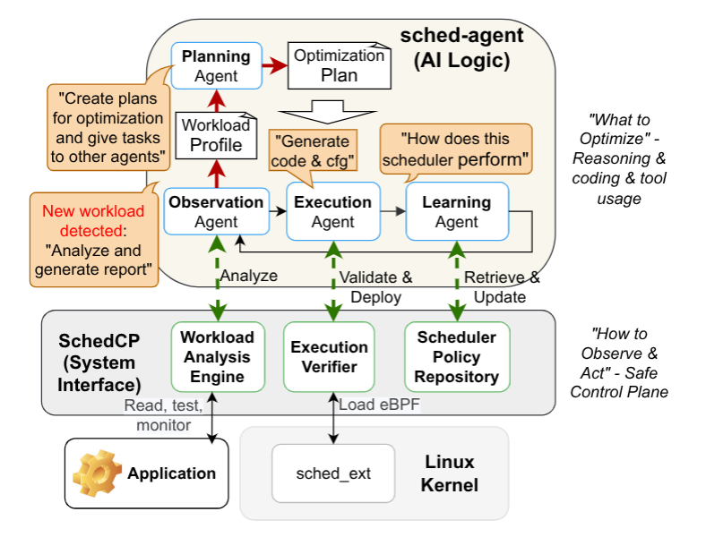

# SchedCP - Automatically Optimize Linux Scheduler with MCP Server

> WIP: We are building a benchmark for evaluating the optimizations for OS!

SchedCP is an `experimental` project that enables AI optimization of Linux kernel schedulers using the sched-ext framework. It provides e2e automatic scheduler selection/synthesis, workload profiling, and performance optimization without any human intervention or guidance.

Paper: [SchedCP: Towards Agentic OS](https://arxiv.org/abs/2509.18256)

It includes the following tools:

- **autotune** - AI Agent-powered automatic OS optimization
- **schedcp** - MCP server for scheduler management and generation

## Demo

Start optimize any workload with AI by simply run:

```sh
autotune/target/release/autotune cc "<your workload command>"
# example for linux build
autotune/target/release/autotune cc "make -C workloads/linux-build-bench/linux clean -j && make -C workloads/linux-build-bench/linux -j" 
# example for schbench
autotune/target/release/autotune cc  workloads/basic/schbench/schbench
```

Allow LLM Agent to auto select and config the best scheduler:


Allow LLM Agents to write new schedulers:

## Features & design

- Automatic workload profiling
- Automatic scheduler selection based on workload characteristics
- Performance tracking across different schedulers
- Real-time scheduler management and generation



The current MCP tools include:

- **list_schedulers** - Get detailed information about all available schedulers
- **run_scheduler** - Start schedulers with custom configurations
- **stop_scheduler** - Stop running scheduler instances
- **get_execution_status** - Monitor scheduler performance and output
- **create_and_verify_scheduler** - Create custom BPF schedulers from source code
- **system_monitor** - Collect real-time CPU, memory, and scheduler metrics
- **workload** - Manage workload profiles and execution history

## Installation

### Requirements

- Linux kernel 6.12+ with sched-ext support  
- Rust toolchain

The major dependencies are the dependencies for the sched-ext framework. You can check the [github.com/sched-ext/scx](https://github.com/sched-ext/scx) for more details.

You also need to install the deps for the workloads you want to optimize.

### Build

```bash
# Clone with submodules
git clone https://github.com/eunomia-bpf/schedcp
cd schedcp
git submodule update --init --recursive scheduler/scx

# Build schedulers
cd scheduler && make && make install && cd ..
# Build autotune
cd autotune && cargo build --release && cd ..
# Build MCP server
cd mcp && cargo build --release && cd ..
```

## Usage

**You should run the claude-code on project root directory.**

### Autotune (Recommended)

```bash
# Set sudo password
export SCHEDCP_SUDO_PASSWORD="your_password"

# Optimize any workload
./autotune/target/release/autotune cc "<your workload command>"
```

### MCP Server

check the [.mcp.json](.mcp.json) for more details. You can just open the claude-code on the 

### CLI Tool

```bash
export SCHEDCP_SUDO_PASSWORD="your_password"

# List schedulers
./mcp/target/release/schedcp-cli list

# Run a scheduler
./mcp/target/release/schedcp-cli run scx_rusty --sudo

# Check status
./mcp/target/release/schedcp-cli status
```

## Related Projects

- [sched-ext](https://github.com/sched-ext/scx) - Linux kernel BPF scheduler framework
- [Model Context Protocol](https://modelcontextprotocol.io/) - AI-application integration protocol

## License

See [LICENSE](LICENSE) for details.
